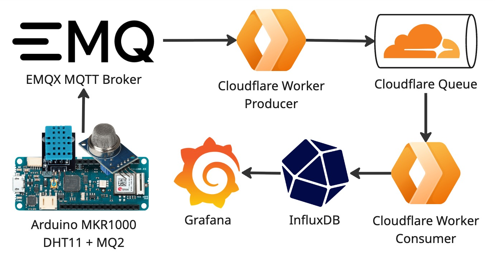
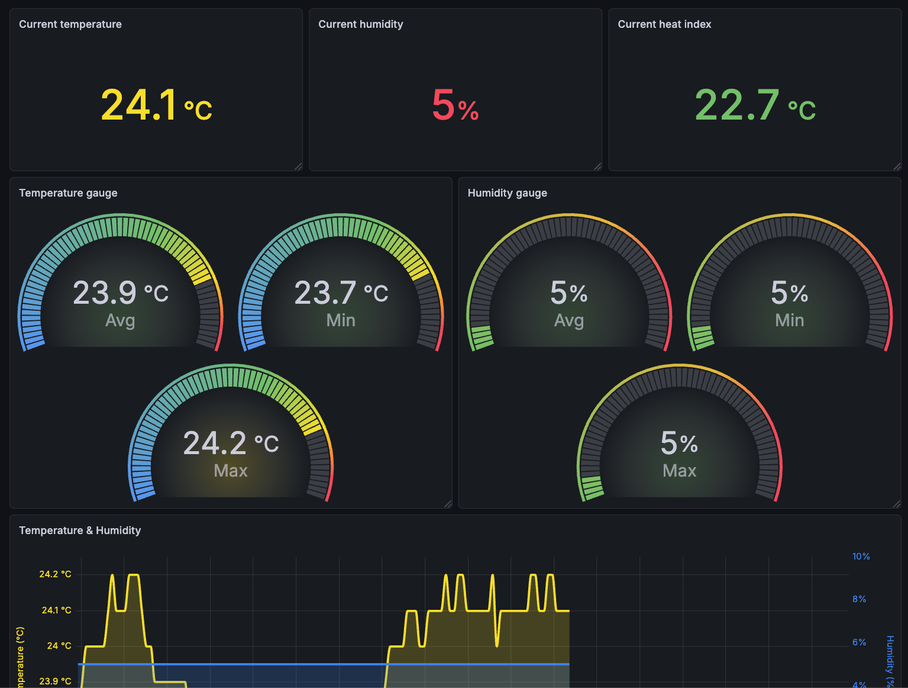

# Biome

DIY indoor climate monitoring.

## Architecture

## Screenshot

## Stack

- [Arduino MKR1000 WiFi](https://docs.arduino.cc/hardware/mkr-1000-wifi/)
- [EMQX Broker](https://www.emqx.com/en/mqtt/public-mqtt5-broker)
- [Cloudflare Workers](https://www.cloudflare.com/products/workers/)
- [Cloudflare Queue](https://www.cloudflare.com/products/queues/)
- [InfluxDB](https://www.influxdata.com/lp/influxdb-database/)
- [Grafana](https://grafana.com/)
